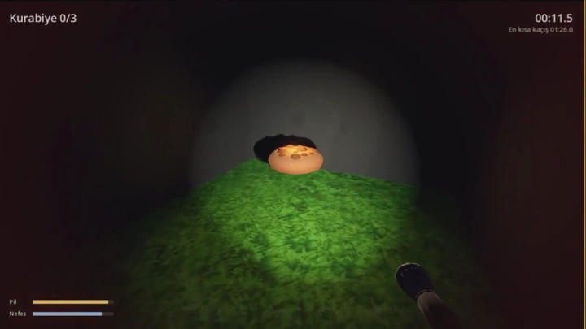

# Kaçış Bebiş

Birinci şahıs labirentten kaçış oyunu. Her turda yeniden oluşan karanlık bir labirentte üç kurabiyeyi bul ve çıkış kapısına ulaş. Bu sırada bir takipçi seni görerek ve duyarak avlıyor.

## Oyna

[Releases](https://github.com/bebisland/yusufipk-kacis-bebis/releases/latest) sayfasından sistemine uygun dosyayı indir ve çalıştır, kurulum gerekmiyor.

- **Windows:** `KacisBebis.exe`. Dosya imzalı olmadığı için SmartScreen uyarı verebilir: "Ek bilgi"ye, sonra "Yine de çalıştır"a tıkla.
- **Linux:** `chmod +x KacisBebis.x86_64 && ./KacisBebis.x86_64`

Vulkan destekleyen bir ekran kartı gerekiyor (Windows'ta Direct3D 12 de yeterli).

## Kontroller

- **Fare:** etrafa bak (imleci yakalamak için tıkla, **Esc** bırakır)
- **WASD:** yürü, **Shift:** koş
- **F:** fener
- **Boşluk**, **Enter** ya da **Esc:** videoyu geç
- **R:** tur bitince yeniden başla

## Kaynak koddan çalıştır

`project.godot` dosyasını [Godot 4.7](https://godotengine.org/download) ile aç ve F5'e bas.

## Lisans

Kod MIT lisanslı. `assets/` klasöründeki modeller, dokular, müzik ve videolar bu lisansın kapsamında değil.
